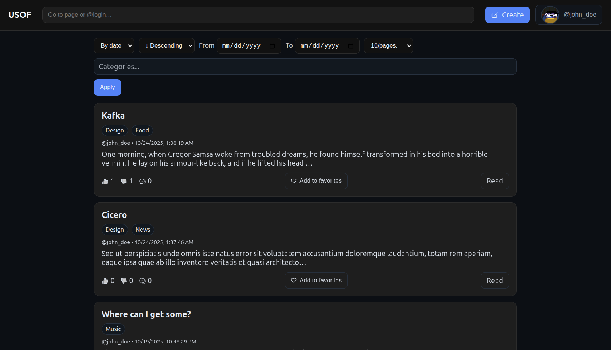
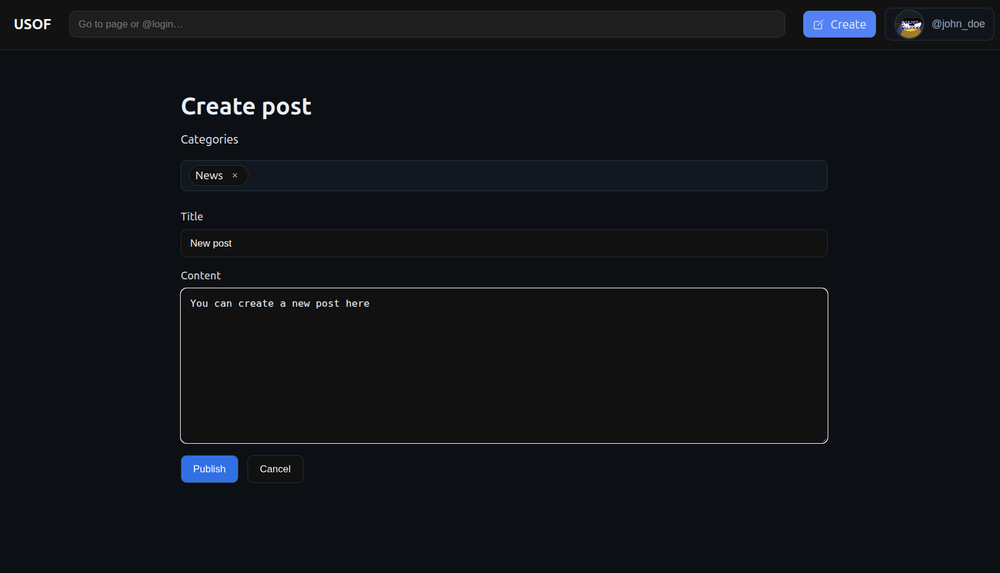
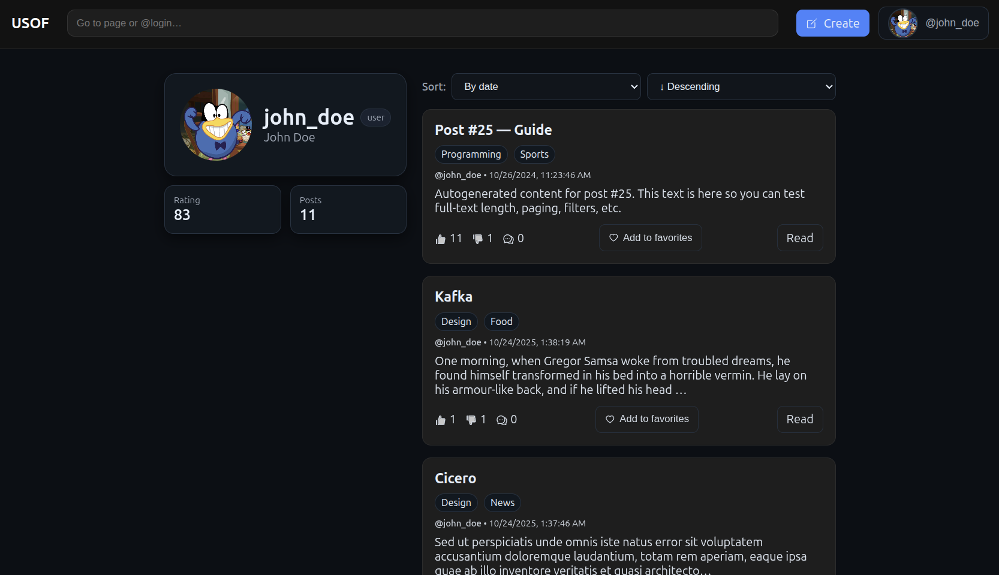
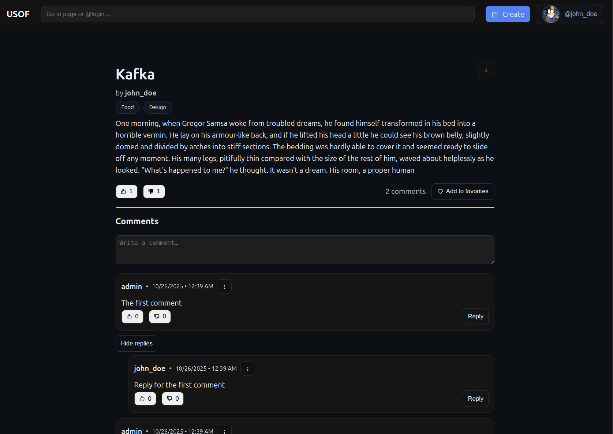
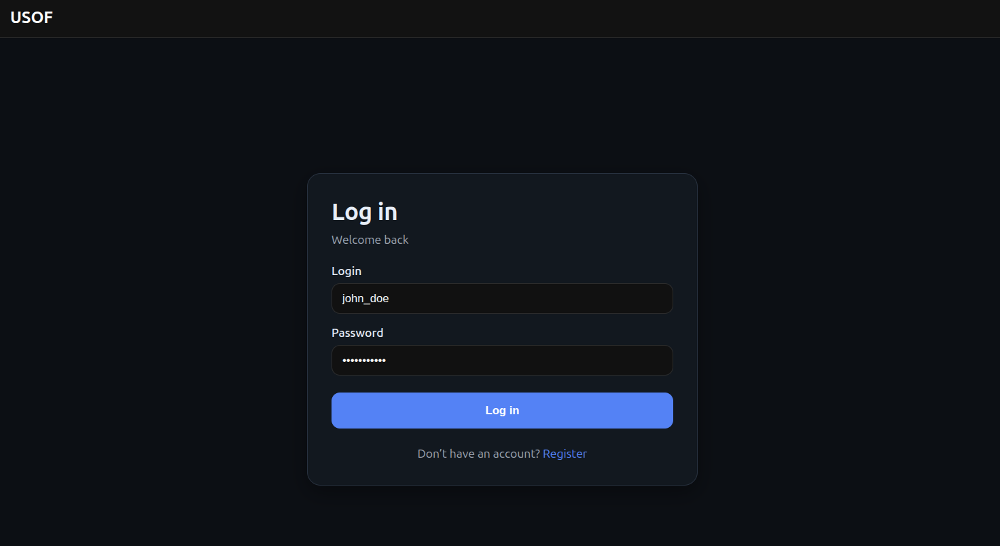
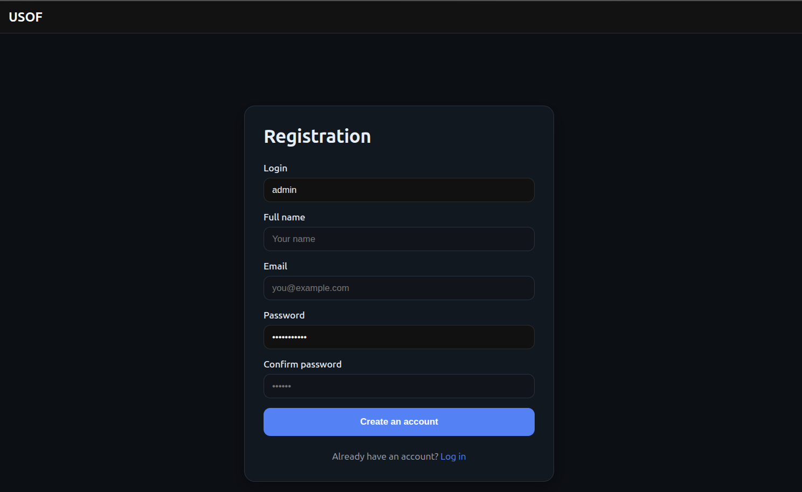
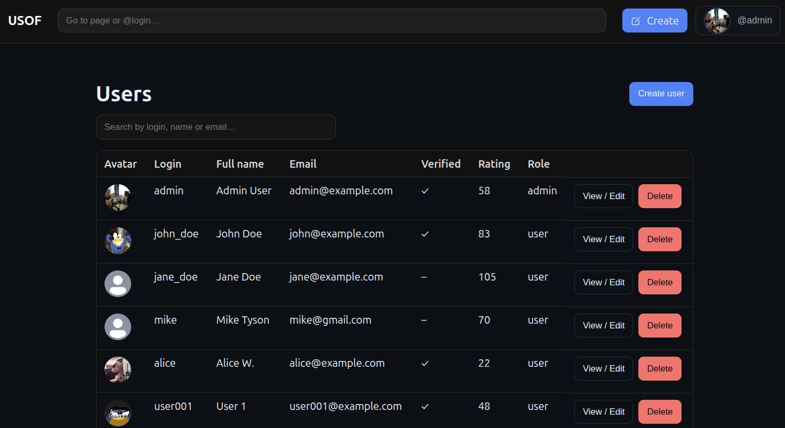

# USOF Frontend

A modern **React-based frontend** for the *USOF* social blogging platform — a full-featured web app where users can register, publish posts, comment, like, and manage favorites.  
The interface provides a clean, responsive layout with authorization, user profiles, and admin features for managing content.

---

## ✨ Features

- 🔐 **User authentication** (registration, login, email verification, password reset)  
- 📰 **Post management** — create, edit, and view posts with categories  
- 💬 **Comments and reactions** — likes, dislikes, favorites  
- 👤 **User profiles** with rating, and posts list  
- 🧭 **Search and navigation** with command bar and filters  
- ⚙️ **Admin features** (restricted to authorized users)  
- 📱 **Fully responsive UI** — adaptive layout for desktop and mobile  

---

## 🖼️ Screenshots
 
1. **🏠 Homepage with posts list**

2. **📝 Post creation form**  

3. **👤 User profile page**

4. **💬 Single post with comments**

5. **🔐 Login and registration pages**


6. **⚙️ Admin page**



---

## ⚙️ Requirements and Dependencies

### Prerequisites
- **Node.js** ≥ 18  
- **npm** package manager  
- Backend API running locally or on a server

### Main dependencies
| Package | Purpose |
|----------|----------|
| `react`, `react-dom` | UI rendering |
| `react-router-dom` | Routing and navigation |
| `redux`, `@reduxjs/toolkit`, `react-redux` | Global state management |
| `axios` | API requests |
| `react-hook-form`, `zod` | Forms and validation |
| `react-icons` | UI icons |
| `tailwindcss` or custom CSS modules | Styling |
| `vite` | Fast development server and bundler |

---

## 🚀 How to Run the Project

Follow these steps to build and launch the frontend locally.

### 1️⃣ Clone the repository
```bash
git clone https://github.com/<your-username>/usof-frontend.git
cd usof-frontend
```

### 2️⃣ Install dependencies
```bash
npm install
```

### 3️⃣ Configure environment variables
Create a `.env` file in the root directory with backend API URL and other options:
```bash
REACT_APP_API_URL=http://host:port/api
REACT_APP_API_BASE=http://host:port
```

### 4️⃣ Run the development server
```bash
npm run dev
```

The app will be available at:
👉 http://host:port/

### 5️⃣ Build for production
```bash
npm run build
npm run preview
```